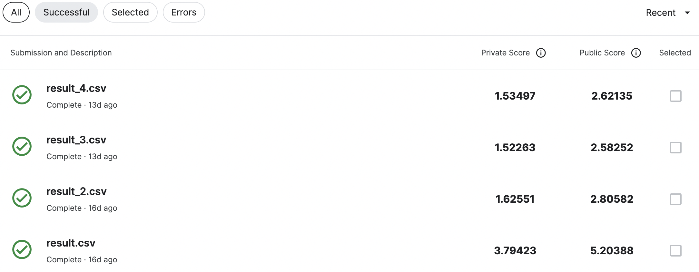
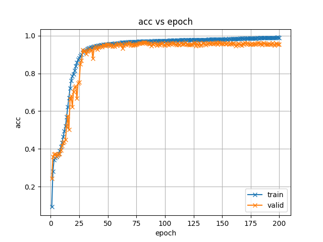

# taiwanese-speech-recognition-using-transformer-yukihung
# HW1 清華大學資安所 洪幸里 學號：111164512

# 作法
### 參數
ttt
這次作業我使用branchformer當作訓練的模型  
調整train_asr_branchformer.yaml檔內的 <br> 
```
batch_bins: 4000000  
max_epoch: 30, 60, 100, 200  
```
我用兩張1080ti來train，並用四個epoch數來測試。一開始選epoch=30是因為怕訓練太久不成功，所以先用小的數字，上傳到kaggle的分數是 5.20388  
第二次使用epoch=60，分數是2.80582  <br><br>
後來想說能不能讓表現更好，所以提高epoch數  
epoch=100時分數等於2.58252  
epoch=200時分數等於2.62135

### 格式處理
最後輸出的文檔在
```
/exp/decode_asr_branchformer_asr_model_valid.acc.ave/decode_asr_branchformer_asr_model_valid.acc.ave/test/text
```
但格式不符合上傳的sample.csv，所以我請chatGPT幫我寫了兩個整理的腳本：sort.py, sort2.py。把文檔跟兩個python檔放在同個資料夾，然後分別執行sort.py, sort2.py，最後再輸出的csv檔的最上面加上id,text，就可以上傳到kaggle上

# 結論
可以看到當epoch數單純的拉高不一定會有正向的幫助，甚至在train的過程中會常看到log會提到這次訓練沒有任何的improvement。<br><br>
而我最終最好的結果是epoch=100，如果還有時間的話我會再把100~200之間試試看能不能找到最好的epoch數。

